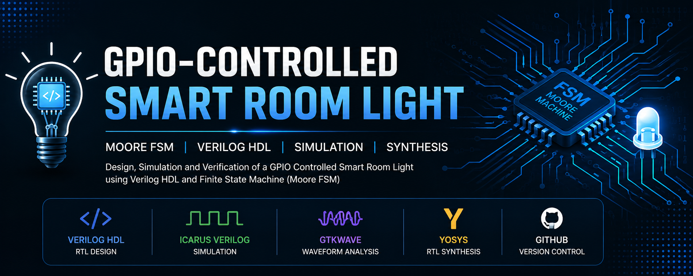
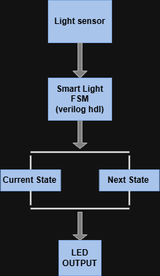
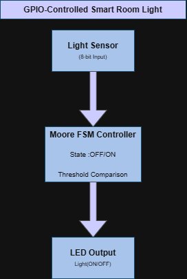
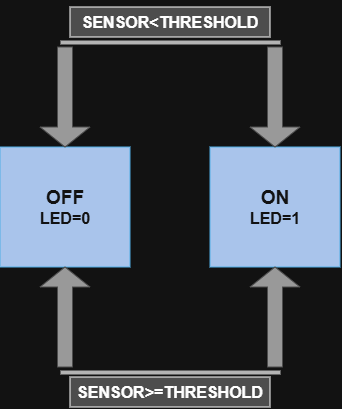
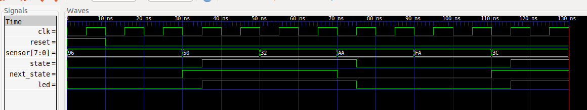
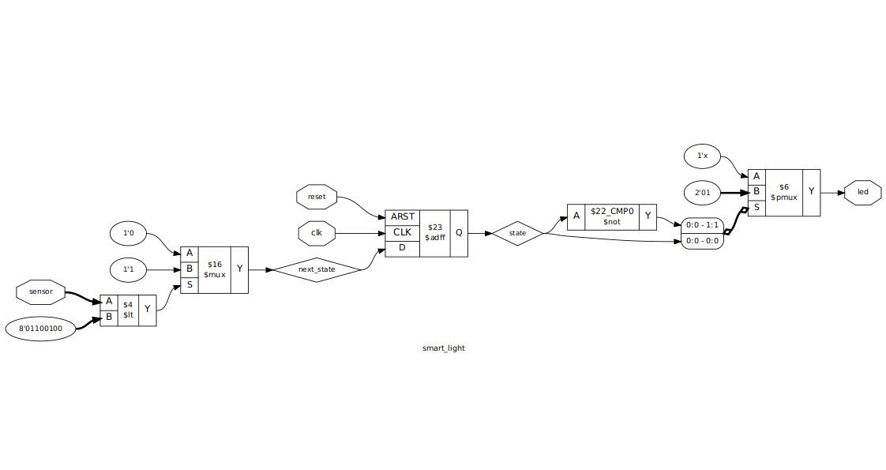

# GPIO-Controlled Smart Room Light




---

## Project Overview

The **GPIO-Controlled Smart Room Light** is a Moore Finite State Machine (FSM) implemented in **Verilog HDL** that automatically controls a room light based on ambient light intensity.

The controller continuously monitors an **8-bit light sensor input** and turns the LED **ON** when the environment becomes dark and **OFF** when sufficient light is available.

This project demonstrates the complete RTL design flow:

- RTL Design using Verilog HDL
- Functional Simulation using Icarus Verilog
- Waveform Verification using GTKWave
- RTL Synthesis using Yosys
- Version Control using Git & GitHub

---

# Features

- Moore Finite State Machine
- Automatic Room Light Control
- Threshold-based Decision Making
- 8-bit Sensor Input
- LED Output Control
- Synthesizable RTL
- Complete Testbench
- GTKWave Waveform Verification
- Yosys RTL Synthesis

---

# System Architecture



---

# Block Diagram



---

# Flowchart


---

# Moore FSM



---

# State Transition Table

| Current State | Sensor Condition | Next State | LED Output |
|---------------|------------------|------------|------------|
| OFF | Sensor < Threshold | ON | ON |
| OFF | Sensor ≥ Threshold | OFF | OFF |
| ON | Sensor < Threshold | ON | ON |
| ON | Sensor ≥ Threshold | OFF | OFF |

---

# RTL Design

The controller consists of four major blocks:

- Threshold Comparator
- Moore FSM
- State Register
- Output Logic

The current state is stored in a flip-flop and updated on every positive edge of the clock. The next state depends only on the current state and the sensor input, while the LED output depends solely on the current state.

---

# RTL Source

```
rtl/
└── smart_light.v
```

The Verilog module implements:

- State Register
- Next State Logic
- Output Logic

using synthesizable RTL coding style.

---

# Testbench

```
testbench/
└── tb_smart_light.v
```

The testbench generates

- Clock
- Reset
- Different sensor values

to verify the functionality of the design under multiple operating conditions.

---

# Simulation Result

The design was simulated using **Icarus Verilog** and verified using **GTKWave**.



The waveform demonstrates:

- Reset operation
- Sensor value changes
- State transitions
- LED response

---

# RTL Schematic (Yosys)

The synthesized RTL generated using **Yosys** is shown below.



The RTL illustrates the synthesized hardware, including:

- Comparator
- Multiplexers
- State Register
- Output Logic

---

# Folder Structure

```text
GPIO-Controlled-Smart-Room-Light
│
├── docs/
│
├── images/
│   ├── architecture.png
│   ├── banner.png
│   ├── block_diagram.png
│   ├── flowchart.png
│   ├── fsm_diagram.png
│   ├── gtkwave.png
│   └── yosys_rtl.png
│
├── rtl/
│   └── smart_light.v
│
├── simulation/
│   └── smart_light.vcd
│
├── synthesis/
│   └── synthesis.ys
│
├── testbench/
│   └── tb_smart_light.v
│
├── README.md
├── LICENSE
└── .gitignore
```

---

# How to Run

## Compile

```bash
iverilog -o smart_light rtl/smart_light.v testbench/tb_smart_light.v
```

---

## Run Simulation

```bash
vvp smart_light
```

---

## View Waveform

```bash
gtkwave simulation/smart_light.vcd
```

---

## Run RTL Synthesis

```bash
yosys synthesis/synthesis.ys
```

---

# Tools Used

| Tool | Purpose |
|------|---------|
| Verilog HDL | RTL Design |
| Icarus Verilog | Functional Simulation |
| GTKWave | Waveform Analysis |
| Yosys | RTL Synthesis |
| Git | Version Control |
| GitHub | Repository Hosting |

---

# Applications

- Automatic Room Lighting
- Smart Home Systems
- Industrial Automation
- IoT Lighting Controllers
- FPGA Learning Projects
- Digital Design Education

---

# Future Improvements

- Configurable Light Threshold
- PWM-based Brightness Control
- FPGA Implementation
- UART Configuration Interface
- Multiple Sensor Support
- Automatic Calibration
- Low-Power Optimization

---

# Learning Outcomes

This project helped develop practical knowledge in:

- Moore FSM Design
- Verilog HDL Coding
- RTL Design Methodology
- Functional Verification
- Testbench Development
- Waveform Analysis
- RTL Synthesis
- Git & GitHub Workflow
- Project Documentation

---

# License

This project is licensed under the **MIT License**.

---

# Author

**Reon Dantis**

Electronics and Communication Engineering

Mangalore Institute of Technology & Engineering

GitHub: https://github.com/Reon-02

---


